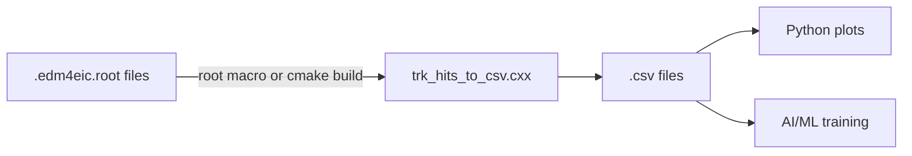

# CSV Convert

The `csv_convert/` directory contains a small toolchain that turns ePIC reconstructed
ROOT files (`*.edm4eic.root`) into flat CSV ready for analysis or ML training.

## Files

| File                       | Role                                                                 |
| -------------------------- | -------------------------------------------------------------------- |
| `trk_hits_to_csv.cxx`      | Main C++ converter. Runs as a ROOT macro **or** built with CMake.    |
| `CMakeLists.txt`           | CMake build for the standalone executable.                           |
| `Snakefile`                | Snakemake workflow: convert + zip many ROOT files in parallel.       |
| `run_jlab_slurm.sh`        | One-shot SLURM submission helper for JLab.                           |
| `pyproject.toml`           | Python dependencies (Snakemake, pandas, matplotlib) — managed by `uv`. |

Plotting / analysis scripts live in [`analyses/`](/) (separate from the converter).
For example, the `time vs z` per-event plotting script lives at
`analyses/time-vs-z-plots/background_analysis.py`.

## Pipeline

## Why this design?

We use **edm4eic** and **edm4hep** C++ libraries to read ePIC simulation data because
they provide convenient navigation between linked objects (hits → particles → vertices)
through PODIO relations.

We store the extracted data as **CSV** because:

1. **Easy to produce in C++** — just format and write lines, no extra dependencies.
2. **Easy to plot with Python** — `pandas.read_csv()` + matplotlib, especially convenient
   when an LLM is generating the plot code.
3. **Easy for AI / ML** — CSV loads directly into numpy, pandas, and PyTorch datasets.
4. **Easy for students** — no special libraries needed to inspect or work with the data.

## Continue reading

- [Running the Converter](/csv-convert-running) — ROOT macro mode and CMake build mode.
- [Snakemake & SLURM](/csv-convert-snakemake) — batch processing many files.
- [Data Format](/data-format) — exact column layout of the CSV.
