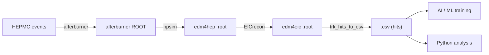

## What is this project?

This site documents the **EIC AI Background** project — a set of tools for producing
and consuming background-rich datasets from full ePIC detector simulations, with a focus
on use cases for AI / ML training and physics studies of detector occupancy.

The work has two pillars:

1. **`full-sim-pipeline/`** — orchestration scripts that drive the ePIC simulation chain
   (`afterburner` → `npsim` → `EICrecon`) on the JLab farm and produce reconstructed
   `edm4eic` ROOT files for one or more beam-energy campaigns.
2. **`csv_convert/`** — a small C++/ROOT converter (`trk_hits_to_csv.cxx`) plus
   Snakemake workflow that flattens those ROOT files into CSV: one row per
   tracker hit with the linked `MCParticle` truth.
3. **`analyses/`** — standalone Python analyses on the produced CSVs. Each
   analysis lives in its own subfolder with its scripts and a short README.

The CSV output is deliberately simple so it can be consumed by Python, by LLM-generated
plotting scripts, or fed directly into a `torch.utils.data.Dataset` for ML training.

## Pipeline at a glance



## Why CSV?

Tracker-hit CSVs are dead simple to produce in C++ (no extra dependencies beyond
`fmt::format`) and trivial to load anywhere downstream:

- `pandas.read_csv()` for exploration and plotting
- `numpy.loadtxt` / `pyarrow` for bulk numeric work
- A few lines of Python for `torch.utils.data.Dataset`
- LLM-generated analysis scripts, which work much more reliably on flat CSV than on
  EDM4EIC's PODIO graph

See the [Data Format](/data-format) page for the exact column layout produced by the
converter.

## Project structure

```
eic-ai-background/
├── csv_convert/              # ROOT → CSV converter + Snakemake workflow
│   ├── trk_hits_to_csv.cxx
│   ├── CMakeLists.txt
│   ├── Snakefile
│   ├── run_jlab_slurm.sh
│   └── pyproject.toml
├── analyses/                 # Python analyses (one subfolder each)
│   └── time-vs-z-plots/
│       └── background_analysis.py
├── full-sim-pipeline/        # ePIC simulation orchestration
│   ├── 10_create_afterburner_jobs.py
│   ├── 20_create_npsim_jobs.py
│   ├── 21_create_npsim_saveall_jobs.py
│   ├── 30_create_eicrecon_jobs.py
│   ├── 40_create_csv_dd4hep_jobs.py
│   ├── 41_create_csv_eicrecon_jobs.py
│   ├── 50_create_analysis_jobs.py
│   ├── job_creator.py
│   └── config-campaign-*.yaml
├── docs/                     # this VitePress site
└── .github/workflows/        # GitHub Pages deployment
```
